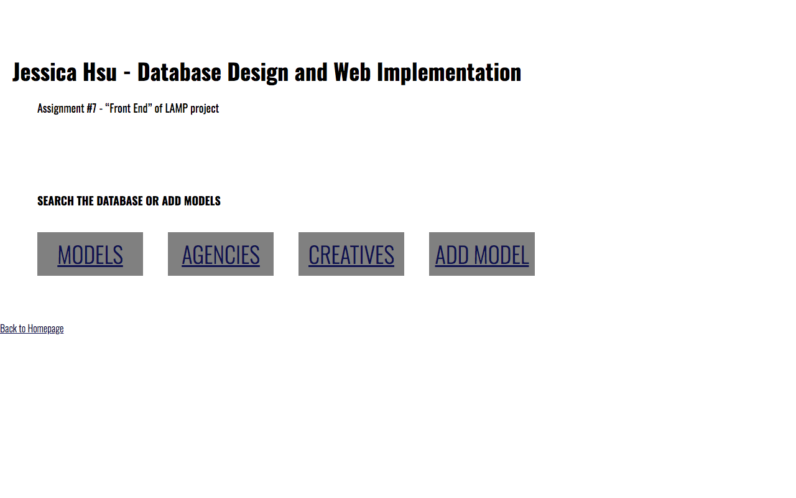

# FASHION DATABASE

A full-stack application for searching creatives, models, agencies across the fashion industry. Created as a project for Database Design and Web Implementation at NYU in Spring 2014.

## Code

- MySQL, PHP, HTML, CSS
- Responsible for database design and full-stack code

## Features

- Searches can be filtered by:
  - individuals : creatives, models
  - agencies: by city and type
- Ability to add individuals and agencies to the database

## Future

- Predictive searching
- Improvement of UI
- Data visualization - i.e. see the history of an individual's career

## Screenshot

